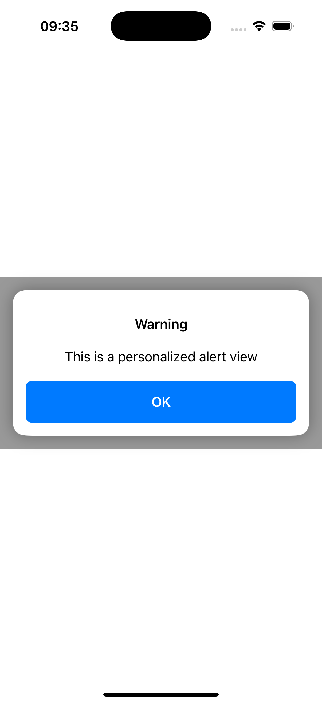

# AlertComponent
Swift UI alert view component. This is the basecode for following post [Maintain, Share, Repeat: iOS Component Distribution](https://javios.eu/swift/maintain-share-r…at-ios-component/)

## Appareance


## ✨ Features

- ✅ Reusable visual alert for SwiftUI
- ✅ Fully customizable (title, message, buttons, actions)
- ✅ Easy integration via Swift Package Manager (SPM)

## 📦 Installation (Swift Package Manager)

To install using Xcode:

1. Go to **File > Add Packages…**
2. Enter the repository URL: https://github.com/JaCaLla/AlertComponentConsumer
3. Choose the version and add the package to your project.

## 📦 Installation (via Tuist)

To install using Xcode:

1. Type: `$tuist edit` from command line
2. In `Project.swift` fill in packages with component GitHub url and version, as well as target dependency
```
let project = Project(
    name: "AlertComponentConsumer",
    packages: [
        .package(url: "https://github.com/JaCaLla/AlertComponent.git", from: "0.2.1")
    ],
    targets: [
        .target(
            name: "AlertComponentConsumer",
            ...
            dependencies: [
                .package(product: "AlertComponent")
            ]
        ),
        ...
    ]
)
```
3. Type: `$tuist generate` from command line, for generating a new XCode project.

## 📦 Existing sample project that is using this component
If you want to start using this componet just fetch following [GitHub repository](https://github.com/JaCaLla/AlertComponentConsumer) where you will find a consumer application which presents the component.


## Requirements

- **Xcode 15.0 or later**
- **iOS 16.0 or later**

